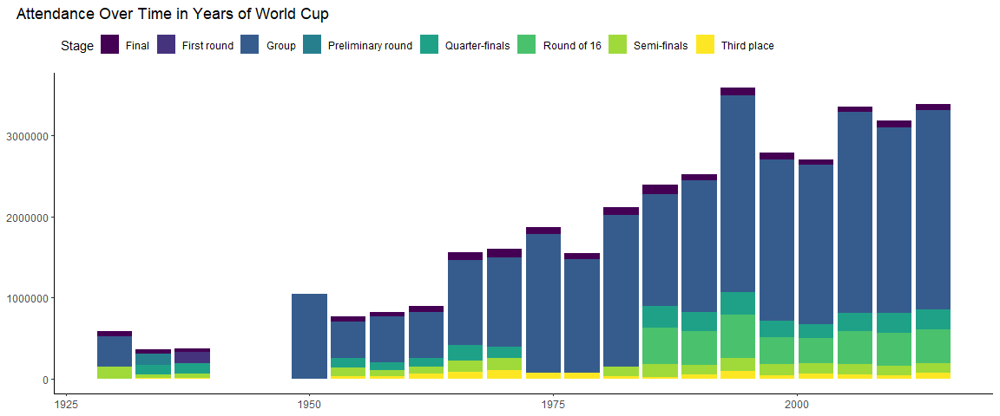

# Data Visualization Project 01

# Load libraries


```r
library(tidyverse)
library(ggtext) # colored text in graph
```

# Read data


```r
# reading the data in
wc <- read_csv("../data/WorldCupMatches.csv")
```

```
## Rows: 4572 Columns: 20
## ── Column specification ────────────────────────────────────────────────────────
## Delimiter: ","
## chr (12): Datetime, Stage, Stadium, City, Home Team Name, Away Team Name, Wi...
## dbl  (8): Year, Home Team Goals, Away Team Goals, Attendance, Half-time Home...
## 
## ℹ Use `spec()` to retrieve the full column specification for this data.
## ℹ Specify the column types or set `show_col_types = FALSE` to quiet this message.
```

After looking at data, I will make data Visualizations about - home vs away (see if a team wins more) - win condition - attendance over time

# Clean data


```r
# check data
head(wc)
```

```
## # A tibble: 6 × 20
##    Year Datetime     Stage Stadium City  Home …¹ Home …² Away …³ Away …⁴ Win c…⁵
##   <dbl> <chr>        <chr> <chr>   <chr> <chr>     <dbl>   <dbl> <chr>   <chr>  
## 1  1930 13 Jul 1930… Grou… Pocitos Mont… France        4       1 Mexico  <NA>   
## 2  1930 13 Jul 1930… Grou… Parque… Mont… USA           3       0 Belgium <NA>   
## 3  1930 14 Jul 1930… Grou… Parque… Mont… Yugosl…       2       1 Brazil  <NA>   
## 4  1930 14 Jul 1930… Grou… Pocitos Mont… Romania       3       1 Peru    <NA>   
## 5  1930 15 Jul 1930… Grou… Parque… Mont… Argent…       1       0 France  <NA>   
## 6  1930 16 Jul 1930… Grou… Parque… Mont… Chile         3       0 Mexico  <NA>   
## # … with 10 more variables: Attendance <dbl>, `Half-time Home Goals` <dbl>,
## #   `Half-time Away Goals` <dbl>, Referee <chr>, `Assistant 1` <chr>,
## #   `Assistant 2` <chr>, RoundID <dbl>, MatchID <dbl>,
## #   `Home Team Initials` <chr>, `Away Team Initials` <chr>, and abbreviated
## #   variable names ¹​`Home Team Name`, ²​`Home Team Goals`, ³​`Away Team Goals`,
## #   ⁴​`Away Team Name`, ⁵​`Win conditions`
```


```r
# remove spaces from variable names
names(wc) <- make.names(names(wc))
# reduce dataset to just columns I will be using
wc <- select(wc, c("Year", "Stage", "Home.Team.Name", "Away.Team.Name", "Home.Team.Goals", "Away.Team.Goals", "Win.conditions", "Attendance"))
# check changes
wc
```

```
## # A tibble: 4,572 × 8
##     Year Stage   Home.Team.Name Away.Team.Name Home.Te…¹ Away.…² Win.c…³ Atten…⁴
##    <dbl> <chr>   <chr>          <chr>              <dbl>   <dbl> <chr>     <dbl>
##  1  1930 Group 1 France         Mexico                 4       1 <NA>       4444
##  2  1930 Group 4 USA            Belgium                3       0 <NA>      18346
##  3  1930 Group 2 Yugoslavia     Brazil                 2       1 <NA>      24059
##  4  1930 Group 3 Romania        Peru                   3       1 <NA>       2549
##  5  1930 Group 1 Argentina      France                 1       0 <NA>      23409
##  6  1930 Group 1 Chile          Mexico                 3       0 <NA>       9249
##  7  1930 Group 2 Yugoslavia     Bolivia                4       0 <NA>      18306
##  8  1930 Group 4 USA            Paraguay               3       0 <NA>      18306
##  9  1930 Group 3 Uruguay        Peru                   1       0 <NA>      57735
## 10  1930 Group 1 Chile          France                 1       0 <NA>       2000
## # … with 4,562 more rows, and abbreviated variable names ¹​Home.Team.Goals,
## #   ²​Away.Team.Goals, ³​Win.conditions, ⁴​Attendance
```

I noticed some rows were repeated


```r
# remove duplicate rows
wc <- distinct(wc)
# remove a row of just NA
wc <- wc[-837,]
wc
```

```
## # A tibble: 836 × 8
##     Year Stage   Home.Team.Name Away.Team.Name Home.Te…¹ Away.…² Win.c…³ Atten…⁴
##    <dbl> <chr>   <chr>          <chr>              <dbl>   <dbl> <chr>     <dbl>
##  1  1930 Group 1 France         Mexico                 4       1 <NA>       4444
##  2  1930 Group 4 USA            Belgium                3       0 <NA>      18346
##  3  1930 Group 2 Yugoslavia     Brazil                 2       1 <NA>      24059
##  4  1930 Group 3 Romania        Peru                   3       1 <NA>       2549
##  5  1930 Group 1 Argentina      France                 1       0 <NA>      23409
##  6  1930 Group 1 Chile          Mexico                 3       0 <NA>       9249
##  7  1930 Group 2 Yugoslavia     Bolivia                4       0 <NA>      18306
##  8  1930 Group 4 USA            Paraguay               3       0 <NA>      18306
##  9  1930 Group 3 Uruguay        Peru                   1       0 <NA>      57735
## 10  1930 Group 1 Chile          France                 1       0 <NA>       2000
## # … with 826 more rows, and abbreviated variable names ¹​Home.Team.Goals,
## #   ²​Away.Team.Goals, ³​Win.conditions, ⁴​Attendance
```


```r
# make stage a factor since it is categorical
wc$Stage <- as.factor(wc$Stage)
```

I think that the final stage is more interesting and there cannot be draws, so I will focus on just that for my home vs away and win condition data visualizations


```r
# take final stage subset of data
finals <- filter(wc, Stage == "Final")
finals
```

```
## # A tibble: 19 × 8
##     Year Stage Home.Team.Name Away.Team.Name Home.Team…¹ Away.…² Win.c…³ Atten…⁴
##    <dbl> <fct> <chr>          <chr>                <dbl>   <dbl> <chr>     <dbl>
##  1  1930 Final Uruguay        Argentina                4       2 <NA>      68346
##  2  1934 Final Italy          Czechoslovakia           2       1 Italy …   55000
##  3  1938 Final Italy          Hungary                  4       2 <NA>      45000
##  4  1954 Final Germany FR     Hungary                  3       2 <NA>      62500
##  5  1958 Final Brazil         Sweden                   5       2 <NA>      49737
##  6  1962 Final Brazil         Czechoslovakia           3       1 <NA>      68679
##  7  1966 Final England        Germany FR               4       2 Englan…   96924
##  8  1970 Final Brazil         Italy                    4       1 <NA>     107412
##  9  1974 Final Netherlands    Germany FR               1       2 <NA>      78200
## 10  1978 Final Argentina      Netherlands              3       1 Argent…   71483
## 11  1982 Final Italy          Germany FR               3       1 <NA>      90000
## 12  1986 Final Argentina      Germany FR               3       2 <NA>     114600
## 13  1990 Final Germany FR     Argentina                1       0 <NA>      73603
## 14  1994 Final Brazil         Italy                    0       0 Brazil…   94194
## 15  1998 Final Brazil         France                   0       3 <NA>      80000
## 16  2002 Final Germany        Brazil                   0       2 <NA>      69029
## 17  2006 Final Italy          France                   1       1 Italy …   69000
## 18  2010 Final Netherlands    Spain                    0       1 Spain …   84490
## 19  2014 Final Germany        Argentina                1       0 German…   74738
## # … with abbreviated variable names ¹​Home.Team.Goals, ²​Away.Team.Goals,
## #   ³​Win.conditions, ⁴​Attendance
```

Looking at the data, NA for the final stage win conditions should just mean that there was no special win such as penalties or extra time.


```r
# change NA to normal, since it is a normal win
finals$Win.conditions <- replace(finals$Win.conditions, is.na(finals$Win.conditions) == T, "Normal")
```


```r
unique(finals$Win.conditions)
```

```
## [1] "Normal"                          "Italy win after extra time"     
## [3] "England win after extra time"    "Argentina win after extra time" 
## [5] "Brazil win on penalties (3 - 2)" "Italy win on penalties (5 - 3)" 
## [7] "Spain win after extra time"      "Germany win after extra time"
```

Change win condition to only have the win condition. The winner can be found by looking at the score, except for penalty victories. 1994 Brazil and 2006 Italy won with penalties.


```r
finals$Win.conditions <- replace(finals$Win.conditions, str_detect(finals$Win.conditions, "extra time"), "Extra Time")
finals$Win.conditions <- replace(finals$Win.conditions, str_detect(finals$Win.conditions, "penalties"), "Penalty")

finals
```

```
## # A tibble: 19 × 8
##     Year Stage Home.Team.Name Away.Team.Name Home.Team…¹ Away.…² Win.c…³ Atten…⁴
##    <dbl> <fct> <chr>          <chr>                <dbl>   <dbl> <chr>     <dbl>
##  1  1930 Final Uruguay        Argentina                4       2 Normal    68346
##  2  1934 Final Italy          Czechoslovakia           2       1 Extra …   55000
##  3  1938 Final Italy          Hungary                  4       2 Normal    45000
##  4  1954 Final Germany FR     Hungary                  3       2 Normal    62500
##  5  1958 Final Brazil         Sweden                   5       2 Normal    49737
##  6  1962 Final Brazil         Czechoslovakia           3       1 Normal    68679
##  7  1966 Final England        Germany FR               4       2 Extra …   96924
##  8  1970 Final Brazil         Italy                    4       1 Normal   107412
##  9  1974 Final Netherlands    Germany FR               1       2 Normal    78200
## 10  1978 Final Argentina      Netherlands              3       1 Extra …   71483
## 11  1982 Final Italy          Germany FR               3       1 Normal    90000
## 12  1986 Final Argentina      Germany FR               3       2 Normal   114600
## 13  1990 Final Germany FR     Argentina                1       0 Normal    73603
## 14  1994 Final Brazil         Italy                    0       0 Penalty   94194
## 15  1998 Final Brazil         France                   0       3 Normal    80000
## 16  2002 Final Germany        Brazil                   0       2 Normal    69029
## 17  2006 Final Italy          France                   1       1 Penalty   69000
## 18  2010 Final Netherlands    Spain                    0       1 Extra …   84490
## 19  2014 Final Germany        Argentina                1       0 Extra …   74738
## # … with abbreviated variable names ¹​Home.Team.Goals, ²​Away.Team.Goals,
## #   ³​Win.conditions, ⁴​Attendance
```

Create column containing if home or away won.


```r
finals$Side <- ifelse(finals$Home.Team.Goals - finals$Away.Team.Goals != 0,
                      ifelse(finals$Home.Team.Goals - finals$Away.Team.Goals > 0, "Home", "Away"),
                      "Pen")
```

Manually add winning side for the penalty wins. There is only 2 so it is easy.


```r
finals$Side <- replace(finals$Side, finals$Year == 1994, "Home")
finals$Side <- replace(finals$Side, finals$Year == 2006, "Home")
```


```r
finals
```

```
## # A tibble: 19 × 9
##     Year Stage Home.Team.Name Away.Team.…¹ Home.…² Away.…³ Win.c…⁴ Atten…⁵ Side 
##    <dbl> <fct> <chr>          <chr>          <dbl>   <dbl> <chr>     <dbl> <chr>
##  1  1930 Final Uruguay        Argentina          4       2 Normal    68346 Home 
##  2  1934 Final Italy          Czechoslova…       2       1 Extra …   55000 Home 
##  3  1938 Final Italy          Hungary            4       2 Normal    45000 Home 
##  4  1954 Final Germany FR     Hungary            3       2 Normal    62500 Home 
##  5  1958 Final Brazil         Sweden             5       2 Normal    49737 Home 
##  6  1962 Final Brazil         Czechoslova…       3       1 Normal    68679 Home 
##  7  1966 Final England        Germany FR         4       2 Extra …   96924 Home 
##  8  1970 Final Brazil         Italy              4       1 Normal   107412 Home 
##  9  1974 Final Netherlands    Germany FR         1       2 Normal    78200 Away 
## 10  1978 Final Argentina      Netherlands        3       1 Extra …   71483 Home 
## 11  1982 Final Italy          Germany FR         3       1 Normal    90000 Home 
## 12  1986 Final Argentina      Germany FR         3       2 Normal   114600 Home 
## 13  1990 Final Germany FR     Argentina          1       0 Normal    73603 Home 
## 14  1994 Final Brazil         Italy              0       0 Penalty   94194 Home 
## 15  1998 Final Brazil         France             0       3 Normal    80000 Away 
## 16  2002 Final Germany        Brazil             0       2 Normal    69029 Away 
## 17  2006 Final Italy          France             1       1 Penalty   69000 Home 
## 18  2010 Final Netherlands    Spain              0       1 Extra …   84490 Away 
## 19  2014 Final Germany        Argentina          1       0 Extra …   74738 Home 
## # … with abbreviated variable names ¹​Away.Team.Name, ²​Home.Team.Goals,
## #   ³​Away.Team.Goals, ⁴​Win.conditions, ⁵​Attendance
```

Make categorical data that will be used for graphs into factors


```r
finals$Win.conditions <- as.factor(finals$Win.conditions)
finals$Side <- as.factor(finals$Side)
finals
```

```
## # A tibble: 19 × 9
##     Year Stage Home.Team.Name Away.Team.…¹ Home.…² Away.…³ Win.c…⁴ Atten…⁵ Side 
##    <dbl> <fct> <chr>          <chr>          <dbl>   <dbl> <fct>     <dbl> <fct>
##  1  1930 Final Uruguay        Argentina          4       2 Normal    68346 Home 
##  2  1934 Final Italy          Czechoslova…       2       1 Extra …   55000 Home 
##  3  1938 Final Italy          Hungary            4       2 Normal    45000 Home 
##  4  1954 Final Germany FR     Hungary            3       2 Normal    62500 Home 
##  5  1958 Final Brazil         Sweden             5       2 Normal    49737 Home 
##  6  1962 Final Brazil         Czechoslova…       3       1 Normal    68679 Home 
##  7  1966 Final England        Germany FR         4       2 Extra …   96924 Home 
##  8  1970 Final Brazil         Italy              4       1 Normal   107412 Home 
##  9  1974 Final Netherlands    Germany FR         1       2 Normal    78200 Away 
## 10  1978 Final Argentina      Netherlands        3       1 Extra …   71483 Home 
## 11  1982 Final Italy          Germany FR         3       1 Normal    90000 Home 
## 12  1986 Final Argentina      Germany FR         3       2 Normal   114600 Home 
## 13  1990 Final Germany FR     Argentina          1       0 Normal    73603 Home 
## 14  1994 Final Brazil         Italy              0       0 Penalty   94194 Home 
## 15  1998 Final Brazil         France             0       3 Normal    80000 Away 
## 16  2002 Final Germany        Brazil             0       2 Normal    69029 Away 
## 17  2006 Final Italy          France             1       1 Penalty   69000 Home 
## 18  2010 Final Netherlands    Spain              0       1 Extra …   84490 Away 
## 19  2014 Final Germany        Argentina          1       0 Extra …   74738 Home 
## # … with abbreviated variable names ¹​Away.Team.Name, ²​Home.Team.Goals,
## #   ³​Away.Team.Goals, ⁴​Win.conditions, ⁵​Attendance
```

# Data Visualizations


```r
ggplot(finals) +
  geom_bar(aes(Side, fill = Side)) +
  scale_fill_manual(values = c(Away = "Red", Home = "Blue"), guide = "none") +
  labs(title = "Number of Wins for <span style = 'color:Red;'>Away</span> and <span style='color:Blue;'>Home</span> Sides for World Cup Final Matches") +
  theme_classic() +
  theme(plot.title = element_markdown(hjust = -0.215), axis.title.x = element_blank(), axis.text.x = element_blank(), axis.title.y = element_blank())
```

<!-- -->

It is surprising to see the home side winning so much more often then the away side, since the teams are usually competing in a place that is not theirs and both sides of the field should be equal.


```r
finals %>% 
  group_by(Win.conditions) %>% 
  summarize(n = n()) %>% 
  ggplot() +
    geom_pointrange(aes(x = reorder(Win.conditions, n, decreasing = T), y = n, ymin = 0, ymax = n, color = Win.conditions), size = 2) +
    scale_y_continuous("", breaks = c(seq(2,12,2))) + 
    scale_color_viridis_d() +
    labs(title = "Count of the Win Conditions for World Cup Final Matches") +
    theme_classic() +
    theme(plot.title = element_markdown(hjust = -0.215), axis.title.x = element_blank(), axis.text.x = element_blank(),
          legend.title = element_blank(), legend.position = "top", legend.justification = "left")
```

<!-- -->

Most of the finals ended normally without needing extra time or penalties to determine a winner.


```r
wc %>% 
  mutate(Stage = case_when(str_detect(wc$Stage, "Group") ~ "Group", # merge all the different groups into just one
                        str_detect(wc$Stage, "third") ~ "Third place", # third place match was written in multiple ways
                        T ~ as.character(wc$Stage))
         ) %>% 
  ggplot() +
    geom_col(aes(Year, Attendance, fill = Stage)) +
    scale_fill_viridis_d() +
    labs(title = "Attendance Over Time in Years of World Cup") +
    theme_classic() +
    theme(plot.title = element_markdown(hjust = -0.06), axis.title.x = element_blank(), axis.title.y = element_blank(),
          legend.position = "top", legend.justification = "left") +
    guides(fill=guide_legend(nrow = 1, byrow = T))
```

```
## Warning: Removed 1 rows containing missing values (`position_stack()`).
```

<!-- -->

More people watched the World Cup over time. The gap could have been because of World War 2, 1950 seems to be missing non group data and the World Cups before it in general seems to be missing some data. The group stage having the most attendance makes sense as it has the most matches being played in it.

------------------------------------------------------------------------

# Report

After looking through the dataset choices, I choose to do the World Cup Matches as I like to watch them. I originally intended to create a bar, lollipop and scatterplot as my three data visualizations, but due to the way my target variables looked, I had to switch from a scatterplot to another bar graph. First, before I worked on making the data visualizations, I checked the data for problems and what I wanted to create my graphs on. I choose to do a graph on if the home or away team won for the final match, a graph for how the victor of the final match was determined, and how the attendance of the matches changed over time; I used the finals as I think it is more interesting, and there are no draws. To do this, I had to remove the spaces in variable names for easier use, remove a large number of duplicate rows, remove a row that had NA for all its values, changed the stages variable to factors, and I created a subset of just the final matches.

For my home vs away graph, I made a new variable called side to hold the side that won and calculated it by subtracting the away goals from the home goals. If the goals were above 0 then the home team won and if it is less than 0, the away team won. This worked for all but two matches, where the victor was determined through penalties, so I manually added the winner for those matches. After that, I converted that variable I made into factor to make sure it worked properly in the graph. To make the graph I used geom_bar with the side variable. I made a number of changes to the way it looked. By making a descriptive title, I was able to remove the x axis completely and the title for the y axis. The title had the sides colored using the ggtext package to match the fill of the bars in the graph. I choose to this as it is better to make graphs simpler and I wanted to apply what I learned from the discussion video regarding the title. With this graph, I found out that the home side was usually the one that won, this is unusual as both sides of the field should be equal and the home side usually does not have the home team for the country.

Preparing for the win conditions of the final match was relatively simple, but it was annoying that it was necessary. The final matches can have a win with normal time, extra time, or penalties. If a match ended in normal time, the win condition was NA, so I changed it to Normal, so it would look better for the graph. For matches that ended in extra time or went to a penalty shootout, the win condition would say the winning countries name in the wind condition, so I had to use str_detect with ifelse to make it so if the win condition had extra time or penalty, then the win condition would be set to that. A lollipop graph was made for this. I grouped by win condition and counted the rows for each win condition as n then passed it to ggplot to use geom_pointrange with the x as the win condition reordered from greatest to least and y as n. Similarly to the previous graph, I removed the x axis and the title for the y axis, as I believe my title is descriptive enough. And I removed the legend title for this graph. Looking at the graph, I saw that most final matches ended normally without extra time or penalties, and a penalty shootout was the most uncommon win condition.

My last graph for comparing attendance over time was originally intended to be a scatterplot, but after coloring the points by stage, it was extremely complicated and hard to read. So, I had to switch to a bar graph. Before making the graph, I merged all the different groups into just one group for the graph, and fixed the third place match being called different ways. My graph has the x as year, y as attendance, and the fill as stage. This graph has the x and y axis titles removes to helped simplify it and the fig.width of it was increased to help make it more readable. The graph shows an increase in attendance over time and the group stage having the highest attendance. This makes sense as there is more people and the group stage has the most matches. There is a gap in the data that could be due to World War 2, and some years are missing some stages.

Overall, I tried to make simple data visualizations as they are easier to understand and avoided pie charts. I focused mainly on the layout of my data visualizations and other than for my first graph, I used the viridis colors through scale_color_viridis_d and scale_fill_viridis_d, they help make the different categories in a variable distinct, which is important as they are not ordered. When a unodered categorical variable was graphed, I arranged them in either ascending or descending order. My titles were always in the top left of the graph as that is where people start reading for English, and I removed the axis and legend titles when I believed they were unnecessary. All of the design choices I made, I think help make my data visualizations more understandable.
