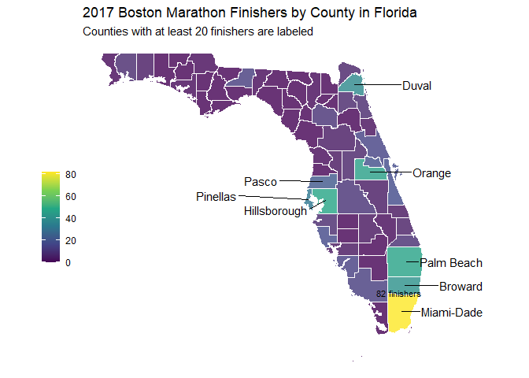

# Data Visualization Project 02

# Load libraries


```r
library(tidyverse)
library(sf)
library(ggrepel)
library(plotly)
library(ggtext)
library(ggpubr)
```

# Read data


```r
marathon <- read_csv("../data/marathon_results_2017.csv")
flCounties <- st_read("../data/Florida_Counties/Florida_Counties.shp", quiet = T)
usCities <- read_csv("../data/uscities.csv") 
```

# Data Wrangling


```r
# check data
head(marathon)
```

```
## # A tibble: 6 × 22
##   Bib   Name     Age `M/F` City  State Country `5K`   `10K` `15K` `20K` Half    
##   <chr> <chr>  <dbl> <chr> <chr> <chr> <chr>   <time> <chr> <chr> <chr> <time>  
## 1 11    Kirui…    24 M     Keri… <NA>  KEN     15'25" 0:30… 0:45… 1:01… 01:04:35
## 2 17    Rupp,…    30 M     Port… OR    USA     15'24" 0:30… 0:45… 1:01… 01:04:35
## 3 23    Osako…    25 M     Mach… <NA>  JPN     15'25" 0:30… 0:45… 1:01… 01:04:36
## 4 21    Biwot…    32 M     Mamm… CA    USA     15'25" 0:30… 0:45… 1:01… 01:04:45
## 5 9     Chebe…    31 M     Mara… <NA>  KEN     15'25" 0:30… 0:45… 1:01… 01:04:35
## 6 15    Abdir…    40 M     Phoe… AZ    USA     15'25" 0:30… 0:45… 1:01… 01:04:35
## # … with 10 more variables: `25K` <time>, `30K` <time>, `35K` <time>,
## #   `40K` <time>, Pace <time>, `Proj Time` <chr>, `Official Time` <time>,
## #   Overall <dbl>, Gender <dbl>, Division <dbl>
```

I want to focus on Florida


```r
# get just people from Florida
flMar <- filter(marathon, State == "FL") 
# check data
head(flMar)
```

```
## # A tibble: 6 × 22
##   Bib   Name     Age `M/F` City  State Country `5K`   `10K` `15K` `20K` Half    
##   <chr> <chr>  <dbl> <chr> <chr> <chr> <chr>   <time> <chr> <chr> <chr> <time>  
## 1 148   Vanos…    45 M     Orla… FL    USA     17'42" 0:35… 0:53… 1:11… 01:15:08
## 2 358   Byers…    36 M     Miami FL    USA     18'14" 0:36… 0:55… 1:13… 01:17:25
## 3 470   Shold…    36 M     Jack… FL    USA     18'20" 0:36… 0:55… 1:13… 01:17:42
## 4 333   Sloan…    29 M     Jack… FL    USA     18'07" 0:36… 0:54… 1:12… 01:15:59
## 5 2123  Hartj…    24 M     Nept… FL    USA     20'21" 0:40… 1:00… 1:19… 01:24:14
## 6 176   Huber…    38 M     Miam… FL    USA     18'08" 0:36… 0:54… 1:13… 01:17:27
## # … with 10 more variables: `25K` <time>, `30K` <time>, `35K` <time>,
## #   `40K` <time>, Pace <time>, `Proj Time` <chr>, `Official Time` <time>,
## #   Overall <dbl>, Gender <dbl>, Division <dbl>
```


```r
# change variable names to make them easier for using
names(flMar) <- make.names(names(flMar))
# remove any rows that could have been duplicated
flMar <- distinct(flMar)
# select just columns I might use
flMar <- select(flMar, c("Age", "M.F", "City", "State", "Official.Time", "Overall", "Gender"))
```


```r
# check for NAs
colSums(is.na(flMar))
```

```
##           Age           M.F          City         State Official.Time 
##             0             0             0             0             0 
##       Overall        Gender 
##             0             0
```

```r
# check data
flMar
```

```
## # A tibble: 609 × 7
##      Age M.F   City             State Official.Time Overall Gender
##    <dbl> <chr> <chr>            <chr> <time>          <dbl>  <dbl>
##  1    45 M     Orlando          FL    02:34:40           94     84
##  2    36 M     Miami            FL    02:35:44          104     92
##  3    36 M     Jacksonville     FL    02:36:40          122    106
##  4    29 M     Jacksonville     FL    02:40:03          188    167
##  5    24 M     Neptune Beach    FL    02:46:56          416    386
##  6    38 M     Miami Beach      FL    02:47:06          424    393
##  7    37 M     Tallahassee      FL    02:47:31          448    417
##  8    27 M     Miami            FL    02:47:35          453    421
##  9    30 M     Jacksonville     FL    02:49:21          536    499
## 10    34 M     Saint Petersburg FL    02:49:31          549    512
## # … with 599 more rows
```

This dataset will only be used to find the county a city is in


```r
# narrow dataset down to just Florida and needed columns
flCities <- usCities %>% 
  filter(state_id == "FL") %>% 
  select(c("city", "county_name"))
```


```r
# add county name to marathon data check for failed matches
left_join(flMar, flCities, c("City" = "city")) %>% 
  filter(is.na(county_name)) 
```

```
## # A tibble: 67 × 8
##      Age M.F   City             State Official.Time Overall Gender county_name
##    <dbl> <chr> <chr>            <chr> <time>          <dbl>  <dbl> <chr>      
##  1    34 M     Saint Petersburg FL    02:49:31          549    512 <NA>       
##  2    43 M     St Petersburg    FL    02:52:16          711    669 <NA>       
##  3    42 F     Lowell           FL    03:03:01         1772    120 <NA>       
##  4    39 M     Land O Lakes     FL    03:09:06         2626   2392 <NA>       
##  5    40 M     Saint Augustine  FL    03:15:53         3833   3377 <NA>       
##  6    47 M     St Johns         FL    03:16:03         3861   3399 <NA>       
##  7    37 M     Lake Worth       FL    03:16:30         3950   3470 <NA>       
##  8    36 M     Port Saint Lucie FL    03:19:24         4533   3913 <NA>       
##  9    41 M     Saint Johns      FL    03:20:00         4654   4005 <NA>       
## 10    41 F     Saint Petersburg FL    03:25:21         5812    988 <NA>       
## # … with 57 more rows
```


```r
# Converting and fixing city names to match names in flCities
flMar$City <- str_replace(flMar$City, "Saint", "St.")
flMar$City <- str_replace(flMar$City, "St ", "St. ")
flMar$City <- str_replace(flMar$City, " O ", " O' ")
flMar$City <- str_replace(flMar$City, " Locka", "-locka")
flMar$City <- str_replace(flMar$City, "Ft.", "Fort ")
flMar$City <- str_replace(flMar$City, "Fort  ", "Fort ") # one fort had a extra space
flMar$City <- str_replace(flMar$City, "Deland", "DeLand")
flMar$City <- str_replace(flMar$City, "Augustime", "Augustine")
```


```r
# check for failed matches again
left_join(flMar, flCities, c("City" = "city")) %>% 
  filter(is.na(county_name)) %>% 
  group_by(City) %>% 
  summarize(n = n())
```

```
## # A tibble: 17 × 2
##    City                     n
##    <chr>                <int>
##  1 Amelia Island            1
##  2 Clearwater Beach         1
##  3 Deleon Springs           1
##  4 Lake Worth               3
##  5 Lithia                   2
##  6 Lowell                   1
##  7 Palm Beach Shore         1
##  8 Parrish                  1
##  9 Pensacola Beach          2
## 10 Ponte Vedra              1
## 11 Ponte Vedra Beach        4
## 12 Santa Rosa Beach         4
## 13 St. Johns                8
## 14 Tegucigalpa Honduras     1
## 15 Viera                    1
## 16 Watersound               1
## 17 West Palm                1
```

These cities were not found in the flCities data. Due to time constraints and the small amount of these cities with missing counties, their county will not be manually found and added.


```r
# add counties to marathon data for rows with city matches
flMarCounties <- inner_join(flMar, flCities, c("City" = "city"))
# change county column name to match flCounties country column
flMarCounties <- rename(flMarCounties,  "COUNTYNAME" = "county_name")
flMarCounties
```

```
## # A tibble: 575 × 8
##      Age M.F   City           State Official.Time Overall Gender COUNTYNAME
##    <dbl> <chr> <chr>          <chr> <time>          <dbl>  <dbl> <chr>     
##  1    45 M     Orlando        FL    02:34:40           94     84 Orange    
##  2    36 M     Miami          FL    02:35:44          104     92 Miami-Dade
##  3    36 M     Jacksonville   FL    02:36:40          122    106 Duval     
##  4    29 M     Jacksonville   FL    02:40:03          188    167 Duval     
##  5    24 M     Neptune Beach  FL    02:46:56          416    386 Duval     
##  6    38 M     Miami Beach    FL    02:47:06          424    393 Miami-Dade
##  7    37 M     Tallahassee    FL    02:47:31          448    417 Leon      
##  8    27 M     Miami          FL    02:47:35          453    421 Miami-Dade
##  9    30 M     Jacksonville   FL    02:49:21          536    499 Duval     
## 10    34 M     St. Petersburg FL    02:49:31          549    512 Pinellas  
## # … with 565 more rows
```


```r
# make flCounties county capitalization match flMarCounties
flCounties$COUNTYNAME <- str_to_title(flCounties$COUNTYNAME)
# match this county name
flCounties$COUNTYNAME <- replace(flCounties$COUNTYNAME, flCounties$COUNTYNAME == "Dade", "Miami-Dade")
```


```r
# add the counties from the shapefile that had no runners and put a 0 for their number of runners.
flMarCounties <- flMarCounties %>% 
  group_by(COUNTYNAME) %>% 
  summarise(n = n()) %>% 
  right_join(flCounties, "COUNTYNAME") %>% 
  mutate(n = ifelse(is.na(n), 0, n)) %>% 
  select(c("COUNTYNAME", "n"))
arrange(flMarCounties, desc(n))
```

```
## # A tibble: 67 × 2
##    COUNTYNAME       n
##    <chr>        <dbl>
##  1 Miami-Dade      82
##  2 Hillsborough    48
##  3 Palm Beach      47
##  4 Orange          46
##  5 Broward         41
##  6 Duval           38
##  7 Pinellas        32
##  8 Pasco           22
##  9 Seminole        19
## 10 Brevard         18
## # … with 57 more rows
```

# Data Visualizations


```r
ggplotly(ggplot(flMar) +
  geom_boxplot(aes(M.F, Overall, fill = M.F, color = M.F)) + 
  scale_fill_manual(values = c(F = "lightcoral", M = "lightskyblue"), guide = "none") + 
  scale_color_manual(values = c(F = "Red", M = "Blue"), guide = "none") +
  scale_y_reverse() + # also makes the numbers negative
  labs(title = "<span style = 'color:Blue;'>Male</span> and <span style='color:Red;'>Female</span> Overall Rank for 2017 Boston Marathon Finishers from Florida") +
  theme_minimal() +
  theme(plot.title = element_markdown(), axis.title = element_blank(), axis.text.x = element_blank(), legend.position = "none"))
```

```{=html}
<div id="htmlwidget-48271b08f426db288768" style="width:672px;height:480px;" class="plotly html-widget"></div>
<script type="application/json" data-for="htmlwidget-48271b08f426db288768">{"x":{"data":[{"x":[1,1,1,1,1,1,1,1,1,1,1,1,1,1,1,1,1,1,1,1,1,1,1,1,1,1,1,1,1,1,1,1,1,1,1,1,1,1,1,1,1,1,1,1,1,1,1,1,1,1,1,1,1,1,1,1,1,1,1,1,1,1,1,1,1,1,1,1,1,1,1,1,1,1,1,1,1,1,1,1,1,1,1,1,1,1,1,1,1,1,1,1,1,1,1,1,1,1,1,1,1,1,1,1,1,1,1,1,1,1,1,1,1,1,1,1,1,1,1,1,1,1,1,1,1,1,1,1,1,1,1,1,1,1,1,1,1,1,1,1,1,1,1,1,1,1,1,1,1,1,1,1,1,1,1,1,1,1,1,1,1,1,1,1,1,1,1,1,1,1,1,1,1,1,1,1,1,1,1,1,1,1,1,1,1,1,1,1,1,1,1,1,1,1,1,1,1,1,1,1,1,1,1,1,1,1,1,1,1,1,1,1,1,1,1,1,1,1,1,1,1,1,1,1,1,1,1,1,1,1,1,1,1,1,1,1,1,1,1,1,1,1,1,1,1,1,1,1,1,1,1,1,1,1,1,1,1,1,1,1,1,1,1,1,1,1,1,1,1,1,1,1,1,1,1,1,1,1,1,1,1,1,1,1,1,1,1,1,1,1,1,1,1,1],"y":[-5499,-5513,-2328,-2581,-7229,-6662,-13311,-10458,-5398,-7180,-11592,-3764,-3415,-11084,-5161,-7232,-14542,-5767,-8906,-5548,-1772,-8396,-9761,-12472,-12756,-14894,-1371,-6015,-6164,-3126,-4530,-6937,-8737,-5812,-1712,-5311,-8521,-14798,-15371,-10502,-9993,-3482,-5527,-10587,-12397,-13978,-5197,-6969,-9200,-8849,-10422,-10793,-7631,-12816,-7807,-12972,-11163,-16099,-11241,-9154,-12522,-769,-11325,-3996,-11428,-11501,-16396,-11604,-16488,-6721,-10132,-15066,-11951,-10322,-13470,-11965,-6448,-12053,-16934,-16969,-10518,-15432,-17182,-12362,-1891,-10621,-12448,-17307,-10687,-15293,-17509,-7582,-10796,-14431,-15938,-2518,-17701,-7850,-7856,-6397,-11279,-17854,-17855,-13271,-13300,-17922,-2945,-8576,-8593,-8642,-8663,-11797,-18386,-16717,-10360,-18507,-7091,-13570,-13585,-8977,-13701,-17180,-9017,-3524,-9059,-17216,-18982,-18998,-17407,-19118,-9204,-9269,-17588,-12788,-17643,-4388,-9504,-19472,-9593,-8077,-13127,-9653,-9731,-14705,-9778,-19897,-19931,-14931,-14987,-10045,-10090,-8690,-20379,-13446,-16746,-15216,-15222,-20554,-20557,-20581,-20596,-18712,-20664,-10564,-20759,-13955,-15667,-10626,-14001,-15743,-15790,-10754,-15870,-21248,-19424,-21257,-21281,-16085,-21523,-16129,-6312,-16164,-21614,-21629,-11353,-16257,-16341,-21789,-16487,-21930,-21938,-21944,-22008,-22018,-20407,-22133,-22137,-22190,-22274,-22317,-22318,-12161,-22320,-22321,-22352,-7398,-22365,-22405,-22575,-22616,-17455,-22742,-22753,-23070,-21249,-23118,-7805,-23202,-17740,-17753,-13053,-23380,-23498,-23505,-17863,-23541,-23625,-13314,-17993,-17996,-23805,-18234,-23856,-23934,-22021,-18440,-24090,-18588,-24186,-24211,-18679,-24339,-24351,-24352,-18830,-24413,-18972,-24496,-24499,-18999,-24599,-19146,-14222,-14268,-17600,-24944,-14510,-14519,-25038,-19496,-25113,-25270,-19750,-14659,-25438,-19871,-25465,-25489,-19982,-25546,-25583,-20185,-15057,-25843,-18430,-25977,-26058,-20501,-26130,-26188,-26210,-26243,-26288,-26299,-26309,-26336,-10614,-26354,-26366,-15723,-21140,-21148,-15841,-21234],"hoverinfo":"y","type":"box","fillcolor":"rgba(240,128,128,1)","marker":{"opacity":null,"outliercolor":"rgba(0,0,0,1)","line":{"width":1.88976377952756,"color":"rgba(0,0,0,1)"},"size":5.66929133858268},"line":{"color":"rgba(255,0,0,1)","width":1.88976377952756},"name":"F","legendgroup":"F","showlegend":true,"xaxis":"x","yaxis":"y","frame":null},{"x":[2,2,2,2,2,2,2,2,2,2,2,2,2,2,2,2,2,2,2,2,2,2,2,2,2,2,2,2,2,2,2,2,2,2,2,2,2,2,2,2,2,2,2,2,2,2,2,2,2,2,2,2,2,2,2,2,2,2,2,2,2,2,2,2,2,2,2,2,2,2,2,2,2,2,2,2,2,2,2,2,2,2,2,2,2,2,2,2,2,2,2,2,2,2,2,2,2,2,2,2,2,2,2,2,2,2,2,2,2,2,2,2,2,2,2,2,2,2,2,2,2,2,2,2,2,2,2,2,2,2,2,2,2,2,2,2,2,2,2,2,2,2,2,2,2,2,2,2,2,2,2,2,2,2,2,2,2,2,2,2,2,2,2,2,2,2,2,2,2,2,2,2,2,2,2,2,2,2,2,2,2,2,2,2,2,2,2,2,2,2,2,2,2,2,2,2,2,2,2,2,2,2,2,2,2,2,2,2,2,2,2,2,2,2,2,2,2,2,2,2,2,2,2,2,2,2,2,2,2,2,2,2,2,2,2,2,2,2,2,2,2,2,2,2,2,2,2,2,2,2,2,2,2,2,2,2,2,2,2,2,2,2,2,2,2,2,2,2,2,2,2,2,2,2,2,2,2,2,2,2,2,2,2,2,2,2,2,2,2,2,2,2,2,2,2,2,2,2,2,2,2,2,2,2,2,2,2,2,2,2,2,2,2,2,2],"y":[-94,-104,-122,-188,-416,-424,-448,-453,-536,-549,-564,-667,-711,-745,-6444,-877,-955,-1027,-1034,-1104,-11615,-1382,-1436,-1456,-1484,-1501,-1529,-1687,-1711,-16921,-1713,-12147,-1781,-1787,-1809,-1874,-12377,-1992,-2065,-2066,-2279,-2288,-2302,-2323,-7583,-2357,-2515,-12959,-2555,-13003,-2626,-2655,-2680,-2773,-2781,-2838,-2901,-2933,-8568,-2986,-2992,-3063,-13395,-3185,-3193,-3199,-3226,-3234,-3266,-3332,-3355,-3360,-8980,-3416,-13770,-9057,-3590,-3745,-9111,-3833,-3861,-3875,-3950,-19270,-4100,-4104,-4172,-9472,-4459,-4488,-14554,-4533,-4538,-4543,-4654,-4665,-4679,-4874,-4907,-4926,-4965,-5045,-5108,-5133,-6861,-5187,-5195,-20490,-5304,-10396,-5382,-12061,-15412,-5512,-7325,-15467,-15472,-5686,-20896,-5783,-5808,-26391,-5883,-5966,-26405,-6049,-6062,-6091,-6126,-21388,-6183,-6236,-11259,-21572,-6414,-16222,-16255,-6464,-6510,-6616,-6658,-13340,-11635,-6755,-13416,-6892,-11959,-6963,-16805,-12028,-18656,-18676,-13638,-7266,-8994,-7369,-7372,-17203,-7439,-7509,-7526,-7536,-7548,-7566,-12722,-9299,-23075,-7772,-17658,-19468,-23204,-13025,-17780,-8079,-8168,-8295,-23529,-17917,-8554,-17948,-13339,-20139,-13385,-23819,-10101,-8693,-24031,-8765,-8810,-8826,-16840,-15368,-17559,-18680,-10511,-18805,-13836,-13846,-9060,-24460,-13981,-9197,-14025,-14097,-24714,-9905,-9342,-9349,-19439,-11133,-9534,-25039,-9613,-9650,-14631,-19856,-19869,-14780,-24129,-9924,-9987,-21899,-15019,-15046,-11683,-16631,-10206,-15200,-11960,-10378,-13477,-21178,-26402,-24253,-17065,-12274,-20742,-17202,-15528,-20810,-15672,-10655,-24595,-10740,-21678,-21683,-15904,-10809,-15909,-23129,-25014,-11194,-21553,-16155,-17796,-11280,-13241,-26069,-12671,-21727,-23646,-23696,-23700,-16517,-25635,-18265,-16698,-15167,-13450,-24059,-12608,-26379,-25462,-19303,-14412,-13758,-12326,-24395,-22363,-23268,-17272,-20914,-21008,-25436,-16218,-24704,-26392,-22624,-19388,-25005,-15977,-20153,-20252,-23281,-14614,-13174,-25916,-19543,-15431,-18180,-20398,-25515,-13429,-26337,-20618,-18917,-24799,-16552,-14599,-25399,-19509,-21566,-22319,-24802,-25666],"hoverinfo":"y","type":"box","fillcolor":"rgba(135,206,250,1)","marker":{"opacity":null,"outliercolor":"rgba(0,0,0,1)","line":{"width":1.88976377952756,"color":"rgba(0,0,0,1)"},"size":5.66929133858268},"line":{"color":"rgba(0,0,255,1)","width":1.88976377952756},"name":"M","legendgroup":"M","showlegend":true,"xaxis":"x","yaxis":"y","frame":null}],"layout":{"margin":{"t":43.7625570776256,"r":7.30593607305936,"b":13.8812785388128,"l":40.1826484018265},"font":{"color":"rgba(0,0,0,1)","family":"","size":14.6118721461187},"title":{"text":"<span style = 'color:Blue;'>Male<\/span> and <span style='color:Red;'>Female<\/span> Overall Rank for 2017 Boston Marathon Finishers from Florida","font":{"color":"rgba(0,0,0,1)","family":"","size":17.5342465753425},"x":0,"xref":"paper"},"xaxis":{"domain":[0,1],"automargin":true,"type":"linear","autorange":false,"range":[0.4,2.6],"tickmode":"array","ticktext":["F","M"],"tickvals":[1,2],"categoryorder":"array","categoryarray":["F","M"],"nticks":null,"ticks":"","tickcolor":null,"ticklen":3.65296803652968,"tickwidth":0,"showticklabels":false,"tickfont":{"color":null,"family":null,"size":0},"tickangle":-0,"showline":false,"linecolor":null,"linewidth":0,"showgrid":true,"gridcolor":"rgba(235,235,235,1)","gridwidth":0.66417600664176,"zeroline":false,"anchor":"y","title":{"text":"","font":{"color":null,"family":null,"size":0}},"hoverformat":".2f"},"yaxis":{"domain":[0,1],"automargin":true,"type":"linear","autorange":false,"range":[-27720.55,1221.55],"tickmode":"array","ticktext":["0","10000","20000"],"tickvals":[0,-10000,-20000],"categoryorder":"array","categoryarray":["0","10000","20000"],"nticks":null,"ticks":"","tickcolor":null,"ticklen":3.65296803652968,"tickwidth":0,"showticklabels":true,"tickfont":{"color":"rgba(77,77,77,1)","family":"","size":11.689497716895},"tickangle":-0,"showline":false,"linecolor":null,"linewidth":0,"showgrid":true,"gridcolor":"rgba(235,235,235,1)","gridwidth":0.66417600664176,"zeroline":false,"anchor":"x","title":{"text":"","font":{"color":null,"family":null,"size":0}},"hoverformat":".2f"},"shapes":[{"type":"rect","fillcolor":null,"line":{"color":null,"width":0,"linetype":[]},"yref":"paper","xref":"paper","x0":0,"x1":1,"y0":0,"y1":1}],"showlegend":false,"legend":{"bgcolor":null,"bordercolor":null,"borderwidth":0,"font":{"color":"rgba(0,0,0,1)","family":"","size":11.689497716895}},"hovermode":"closest","barmode":"relative"},"config":{"doubleClick":"reset","modeBarButtonsToAdd":["hoverclosest","hovercompare"],"showSendToCloud":false},"source":"A","attrs":{"286012c038b3":{"x":{},"y":{},"fill":{},"colour":{},"type":"box"}},"cur_data":"286012c038b3","visdat":{"286012c038b3":["function (y) ","x"]},"highlight":{"on":"plotly_click","persistent":false,"dynamic":false,"selectize":false,"opacityDim":0.2,"selected":{"opacity":1},"debounce":0},"shinyEvents":["plotly_hover","plotly_click","plotly_selected","plotly_relayout","plotly_brushed","plotly_brushing","plotly_clickannotation","plotly_doubleclick","plotly_deselect","plotly_afterplot","plotly_sunburstclick"],"base_url":"https://plot.ly"},"evals":[],"jsHooks":[]}</script>
```
The best and worst finishers are similar for both genders, but on average males performed better.


```r
# get coordinates for county labeling
flCountiesPoints <- st_centroid(flCounties)
flCountiesPoints <- cbind(flCountiesPoints, st_coordinates(st_centroid(flCountiesPoints$geometry)))

# filter just counties with over 20 finishers
# and split into left and right side for finer control on map
leftPoints <- filter(flCountiesPoints, COUNTYNAME %in% c("Hillsborough", "Pinellas", "Pasco"))
rightPoints <- filter(flCountiesPoints, COUNTYNAME %in% c("Miami-Dade","Palm Beach", "Orange", "Broward", "Duval"))

# spatial visualization
merge(flCounties, flMarCounties, by = "COUNTYNAME") %>% 
  ggplot() +
    geom_sf(aes(fill = n),alpha=0.8, col="white") +
    scale_fill_viridis_c(name = "") +
    geom_text_repel(data = leftPoints, aes(x = X, y = Y, label = COUNTYNAME), nudge_x = -1.5, min.segment.length = 0) + 
    geom_text_repel(data = rightPoints, aes(x = X, y = Y, label = COUNTYNAME), nudge_x = 1.5, min.segment.length = 0) + 
    annotate("text", -Inf, Inf, label = "82 finishers", hjust = -6.55, vjust = 36.5, size = 3) +
    labs(title = "2017 Boston Marathon Finishers by County in Florida", subtitle = "Counties with at least 20 finishers are labeled") +
    theme_void() +
    theme(plot.title = element_text(hjust = -4.3), plot.subtitle = element_text(hjust = -0.825), legend.position = "left")
```

<!-- -->
It is interesting to see most finishers are from southeast Florida with a significant amount in central Florida, and Miami-Dade having a lot more than the rest.


```r
ggplot(flMar, aes(Age, Official.Time, color = M.F)) +
  geom_point(alpha = 0.4) +
  geom_smooth(method = "lm") +
  scale_color_manual(values = c(F = "Red", M = "Blue"), guide_legend(title = "Gender")) +
  stat_regline_equation(aes(label = after_stat(rr.label)), show.legend = F) +
  labs(title = "Age vs Official Time of 2017 Boston Marathon Finishers from Florida") +
  xlab("Age (Year)") +
  ylab("Official Time (HH:MM:SS)") +
  theme_minimal() +
  theme(plot.title = element_markdown(hjust = 7.5))
```

```
## `geom_smooth()` using formula = 'y ~ x'
```

<!-- -->
The correlation between age and the official time achieved is not strong. But the linear model does suggest that older people take longer to finish and more so for males.

---

# Report

My process started started with choosing a dataset. I decided to go with the 2017 Boston Marathon Finishers because it has a good amount of data, multiple variables that I could use, and it has city and state data that could be combined with a shapefile to make a spatial visualization. The dataset was decently formatted and I did not have to do much cleaning. Main changes made were renaming the columns for easier use, creating a subset of just the finishers from Florida with the columns I was going to use, and checking for missing values, which my subset had none of. I was able to make my originally planned charts which were an interactive boxplot, a spatial visualization of Florida counties, and a scatterplot with a linear model.

The interactive boxplot was the first graph I made. It was the gender of the finisher vs their overall rank. For this graph, I tried to keep it simple, so the only labels are the title and the rank values on the y axis. The title has colored words in it to match the gender for each boxplot. I also reversed the y axis, so that 0 is at the top. I think that this makes more sense as a rank closer to 0 is a better performance and I think better numbers should be at the top for a graph. One problem with this though is that hovering over the boxplot after making it interactive through `plotly`, shows a negative sign in front of the statistics for it. I could not find a solution for this, and I also had a problem where `hjust` was not working for this boxplot. However, the graph still looked fine and is able to clearly convey the information I choose from the dataset. The best and worst finishers are similar for both genders, but on average males performed better.

My next graph, the spatial visualization was difficult to make work the way I wanted. It shows the number of finishers per county in Florida, and I labeled the counties with over 20 finishers. My main issue is that I have the city of the finisher from marathon dataset but not their county. So, I found a freely available dataset that has us cities and their counties. I filtered that data down to just Florida cities and did a left join on it with my marathon data to check for missing matches. A large number of failed matches were due to inconsistent spelling and typos in the city name for the marathon data. After fixing those, I did an inner join to get just the matches, as there was only a small amount of cities left with no counties found for it in the US cities dataset. Then I had to do column renaming and changing a city name so that I could merge it with shapefile for Florida counties. I grouped my data by counties and counting the number of occurrences of county and merged that into shapefile for the Florida counties. Finally, with that combined data, I was able to make the spatial visualization. Using it, I saw that most finishers are from southeast Florida with a significant amount in central Florida, and Miami-Dade having a lot more than the rest.
	
My final graph was a scatterplot of the age vs official time for the finishers. The points were colored by gender and I added a linear model for both as well as their R-squared value. This was easy to make through the cleaned data I made before this. My only difficulty was adding the R-squared value, and I used `stat_regline_equation` from the `ggpubr` package to make it easier. Also, to make it easier to see the points at cluttered areas, I lowered the alpha of the points. Contrary to my previous graphs, I kept the axis titles to help explain their value types as I thought they were less clear then the others and putting the value types in the title would make my already long title too long. This graph showed that the correlation between age and the official time achieved is not strong. But the linear model does suggest that older people take longer to finish and more so for males.

Overall, for my graphs, I tried to keep them consistent. I removed any information I believed was unnecessary and repetitive. I kept the colors as consistent as I could. For both my boxplot and scatterplot that had gender in them, male was blue, and females were red. The only graph with different colors was the spatial visualization as it has a continuous variable, and I used the Viridis color palette for it, as it colors for it help show similarities and differences well without overemphasis.
