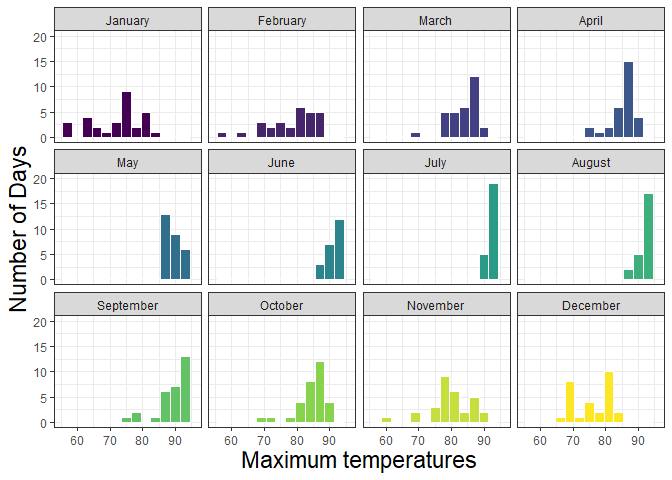
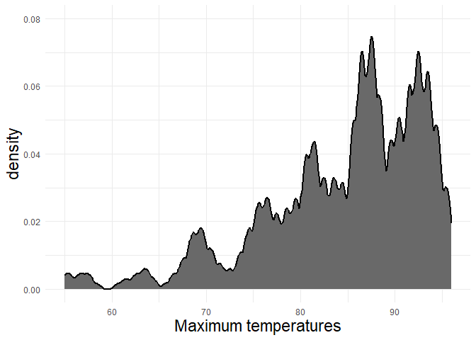
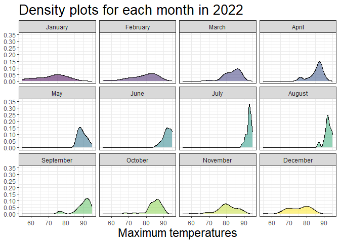
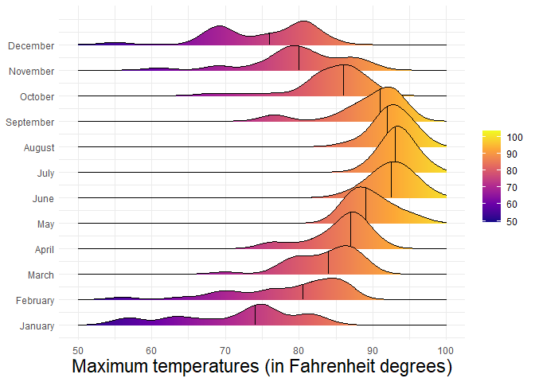
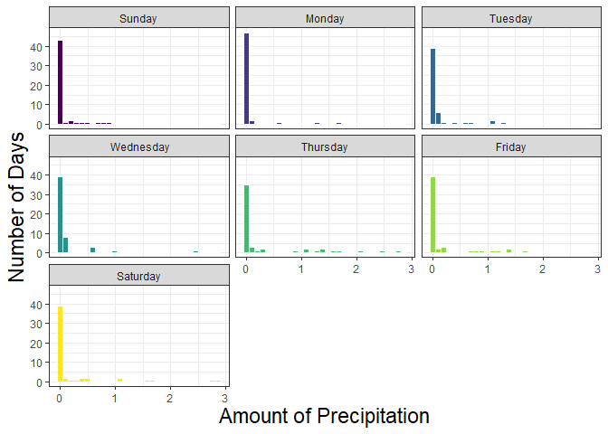
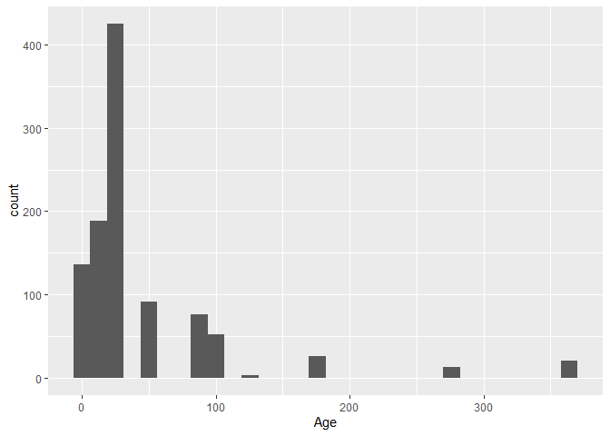
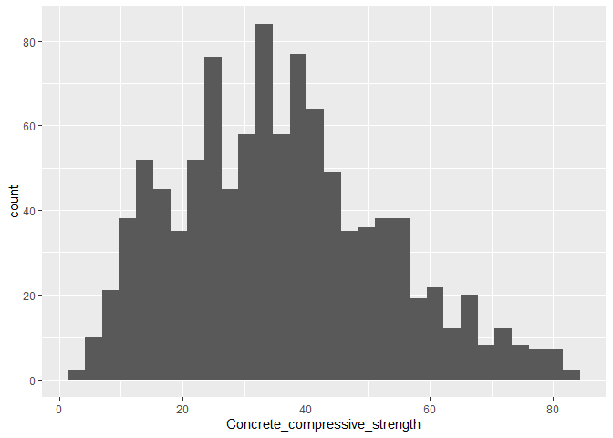
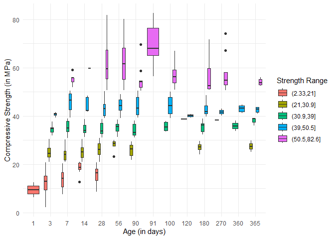
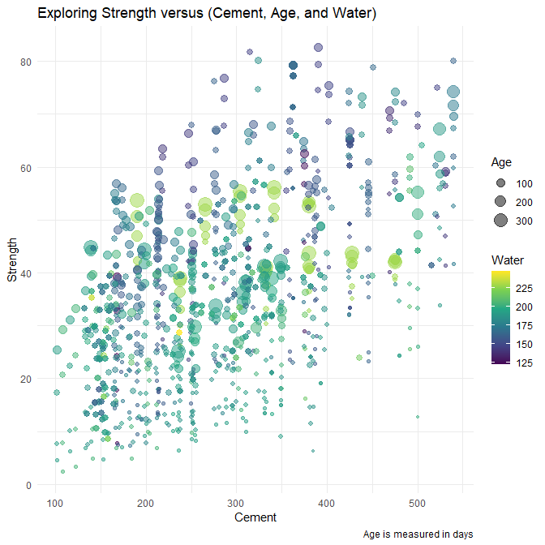

# Data Visualization Project 03


In this exercise you will explore methods to create different types of data visualizations (such as plotting text data, or exploring the distributions of continuous variables).


## PART 1: Density Plots

Using the dataset obtained from FSU's [Florida Climate Center](https://climatecenter.fsu.edu/climate-data-access-tools/downloadable-data), for a station at Tampa International Airport (TPA) for 2022, attempt to recreate the charts shown below which were generated using data from 2016. You can read the 2022 dataset using the code below: 


```r
library(tidyverse)
weather_tpa <- read_csv("https://raw.githubusercontent.com/reisanar/datasets/master/tpa_weather_2022.csv")
# random sample 
sample_n(weather_tpa, 4)
```

```
## # A tibble: 4 × 7
##    year month   day precipitation max_temp min_temp ave_temp
##   <dbl> <dbl> <dbl>         <dbl>    <dbl>    <dbl>    <dbl>
## 1  2022     6     4          0.47       88       75     81.5
## 2  2022    10    15          0          88       74     81  
## 3  2022     6    15          0.11       95       78     86.5
## 4  2022     4    11          0          85       62     73.5
```

See https://www.reisanar.com/slides/relationships-models#10 for a reminder on how to use this type of dataset with the `lubridate` package for dates and times (example included in the slides uses data from 2016).

Using the 2022 data: 

(a) Create a plot like the one below:


Hint: the option `binwidth = 3` was used with the `geom_histogram()` function.


```r
library(lubridate)
```

```
## Loading required package: timechange
```

```
## 
## Attaching package: 'lubridate'
```

```
## The following objects are masked from 'package:base':
## 
##     date, intersect, setdiff, union
```


```r
# tpa clean code from linked slides
tpa_clean <- weather_tpa %>% 
  unite("doy", year, month, day, sep = "-") %>% 
  mutate(doy = ymd(doy), 
         max_temp = as.double(max_temp), 
         min_temp = as.double(min_temp), 
         precipitation = as.double(precipitation))

tpa_clean
```

```
## # A tibble: 365 × 5
##    doy        precipitation max_temp min_temp ave_temp
##    <date>             <dbl>    <dbl>    <dbl>    <dbl>
##  1 2022-01-01       0             82       67     74.5
##  2 2022-01-02       0             82       71     76.5
##  3 2022-01-03       0.02          75       55     65  
##  4 2022-01-04       0             76       50     63  
##  5 2022-01-05       0             75       59     67  
##  6 2022-01-06       0.00001       74       56     65  
##  7 2022-01-07       0.00001       81       63     72  
##  8 2022-01-08       0             81       58     69.5
##  9 2022-01-09       0             84       65     74.5
## 10 2022-01-10       0             81       64     72.5
## # … with 355 more rows
```


```r
month <- c(`1` = "January", `2` = "February", `3` = "March", `4` = "April",
           `5` = "May", `6` = "June", `7` = "July", `8` = "August", 
           `9` = "September", `10` = "October", `11` = "November", `12` = "December")

ggplot(tpa_clean, aes(x = max_temp, fill = month(doy))) +
  geom_histogram(color = "white", binwidth = 3) + 
  scale_fill_viridis_c(guide = "none") + 
  scale_x_continuous(breaks = c(60, 70, 80, 90),limits = c(55, 96)) + 
  ylim(0, 20) + 
  facet_wrap(~ month(doy), labeller = as_labeller(month)) +
  xlab("Maximum temperatures") +
  ylab("Number of Days") + 
  theme_bw() +
  theme(axis.title = element_text(size = 17))
```

```
## Warning: Removed 7 rows containing non-finite values (`stat_bin()`).
```

```
## Warning: Removed 24 rows containing missing values (`geom_bar()`).
```

<!-- -->


(b) Create a plot like the one below:


Hint: check the `kernel` parameter of the `geom_density()` function, and use `bw = 0.5`.


```r
ggplot(tpa_clean, aes(x = max_temp)) +
  geom_density(kernel = "e",bw = 0.5, fill = "dimgrey", linewidth = 1) + 
  scale_x_continuous(breaks = c(60, 70, 80, 90),limits = c(55, 96)) + 
  scale_y_continuous(breaks = seq(0.00, 0.08, 0.02), limits = c(0, 0.08)) +
  xlab("Maximum temperatures") +
  ylab("density") +
  theme_minimal() +
  theme(axis.title = element_text(size = 17))
```

```
## Warning: Removed 7 rows containing non-finite values (`stat_density()`).
```

<!-- -->


(c) Create a plot like the one below:


Hint: default options for `geom_density()` were used. 


```r
ggplot(tpa_clean, aes(x = max_temp, fill = month(doy))) +
  geom_density(aes(alpha = 0.9)) + 
  facet_wrap(~ month(doy), labeller = as_labeller(month)) + 
  scale_fill_viridis_c(guide = "none") +
  scale_x_continuous(breaks = c(60, 70, 80, 90),limits = c(55, 95)) + 
  scale_y_continuous(breaks = seq(0.00, 0.35, 0.05), limits = c(0, 0.35)) +
  labs(title = "Density plots for each month in 2022") +
  xlab("Maximum temperatures") + 
  theme_bw() +
  theme(plot.title = element_text(size = 20), axis.title = element_text(size = 17), axis.title.y = element_blank(), legend.position = "none")
```

```
## Warning: Removed 15 rows containing non-finite values (`stat_density()`).
```

<!-- -->

(d) Generate a plot like the chart below:


Hint: use the`{ggridges}` package, and the `geom_density_ridges()` function paying close attention to the `quantile_lines` and `quantiles` parameters. The plot above uses the `plasma` option (color scale) for the _viridis_ palette.


```r
library(ggridges)
```

```
## Warning: package 'ggridges' was built under R version 4.2.3
```


```r
ggplot(tpa_clean, aes(x = max_temp)) +
  geom_density_ridges_gradient(aes(y = month(doy), group = month(doy), fill = stat(x)), quantile_lines = T, quantiles = 2) + 
  scale_fill_viridis_c(option = "plasma") +
  scale_x_continuous(limits = c(50, 100)) + 
  scale_y_continuous(breaks = seq(1,12), labels = c("January","February","March","April","May","June",
                                                    "July","August","September","October","November","December")) + 
  xlab("Maximum temperatures (in Fahrenheit degrees)") +
  theme_minimal() +
  theme(axis.title = element_text(size = 17), axis.title.y = element_blank(), legend.title = element_blank())
```

```
## Warning: `stat(x)` was deprecated in ggplot2 3.4.0.
## ℹ Please use `after_stat(x)` instead.
## This warning is displayed once every 8 hours.
## Call `lifecycle::last_lifecycle_warnings()` to see where this warning was
## generated.
```

```
## Picking joint bandwidth of 1.87
```

```
## Warning: Using the `size` aesthietic with geom_segment was deprecated in ggplot2 3.4.0.
## ℹ Please use the `linewidth` aesthetic instead.
## This warning is displayed once every 8 hours.
## Call `lifecycle::last_lifecycle_warnings()` to see where this warning was
## generated.
```

<!-- -->


(e) Create a plot of your choice that uses the attribute for precipitation _(values of -99.9 for temperature or -99.99 for precipitation represent missing data)_.


```r
day <- c(`1` = "Sunday", `2` = "Monday", `3` = "Tuesday", `4` = " Wednesday", `5` = "Thursday", `6` = "Friday", `7` = "Saturday")

ggplot(tpa_clean, aes(x = precipitation, fill = wday(doy))) +
  geom_histogram(color = "white") + 
  scale_fill_viridis_c(guide = "none") + 
  facet_wrap(~ wday(doy), labeller = as_labeller(day)) +
  xlab("Amount of Precipitation") +
  ylab("Number of Days") + 
  theme_bw() +
  theme(axis.title = element_text(size = 17))
```

```
## `stat_bin()` using `bins = 30`. Pick better value with `binwidth`.
```

<!-- -->

Day of the week does not seem to really affect the amount of precipitation as expected.


## PART 2 

### Option (B): Data on Concrete Strength 

Concrete is the most important material in **civil engineering**. The concrete compressive strength is a highly nonlinear function of _age_ and _ingredients_. The dataset used here is from the [UCI Machine Learning Repository](https://archive.ics.uci.edu/ml/index.php), and it contains 1030 observations with 9 different attributes 9 (8 quantitative input variables, and 1 quantitative output variable). A data dictionary is included below: 


Variable                      |    Notes                
------------------------------|-------------------------------------------
Cement                        | kg in a $m^3$ mixture             
Blast Furnace Slag            | kg in a $m^3$ mixture  
Fly Ash                       | kg in a $m^3$ mixture             
Water                         | kg in a $m^3$ mixture              
Superplasticizer              | kg in a $m^3$ mixture
Coarse Aggregate              | kg in a $m^3$ mixture
Fine Aggregate                | kg in a $m^3$ mixture      
Age                           | in days                                             
Concrete compressive strength | MPa, megapascals


Below we read the `.csv` file using `readr::read_csv()` (the `readr` package is part of the `tidyverse`)


```r
concrete <- read_csv("../data/concrete.csv", col_types = cols())
```


Let us create a new attribute for visualization purposes, `strength_range`: 


```r
new_concrete <- concrete %>%
  mutate(strength_range = cut(Concrete_compressive_strength, 
                              breaks = quantile(Concrete_compressive_strength, 
                                                probs = seq(0, 1, 0.2))) )
```


1. Explore the distribution of 2 of the continuous variables available in the dataset. Do ranges make sense? Comment on your findings.


```r
ggplot(new_concrete) +
  geom_histogram(aes(Age))
```

```
## `stat_bin()` using `bins = 30`. Pick better value with `binwidth`.
```

<!-- -->

It looks like most of the concrete was measured around a month or earlier after mixing. This makes sense to me, as I think it is good to check if the concrete strength is where it should be and if they are any problems early on.


```r
ggplot(new_concrete) +
  geom_histogram(aes(Concrete_compressive_strength))
```

```
## `stat_bin()` using `bins = 30`. Pick better value with `binwidth`.
```

<!-- -->

The distribution is kind of normal. Which makes sense, as I think there is probably a certain strength that can be used for most things, with a weaker or stronger strength being used in more specialized cases.


2. Use a _temporal_ indicator such as the one available in the variable `Age` (measured in days). Generate a plot similar to the one shown below. Comment on your results.


```r
# one row with compressive strength of 2.331808 was being rounded down and got NA for its range
new_concrete$strength_range[is.na(new_concrete$strength_range)] = "(2.33,21]"
```


```r
ggplot(new_concrete, aes(as.factor(Age), Concrete_compressive_strength, fill = strength_range)) +
  geom_boxplot() +
  labs(x = "Age (in days)", y = "Compressive Strength (in MPa)", fill = "Strength Range") +
  theme_minimal()
```

<!-- -->

Old concretes seem stronger than new concretes, but most of the strongest concretes are around 30 to 100 days old. It looks like age has a stronger impact on the strength of newer concrete and as it settles, other factors impact the strength more.


3. Create a scatterplot similar to the one shown below. Pay special attention to which variables are being mapped to specific aesthetics of the plot. Comment on your results. 


```r
ggplot(new_concrete, aes(Cement, Concrete_compressive_strength, size = Age, color = Water)) +
  geom_point(alpha = 0.5) +
  scale_color_viridis_c() +
  labs(title = "Exploring Strength versus (Cement, Age, and Water)", caption = "Age is measured in days", y = "Strength") +
  theme_minimal()
```

<!-- -->

Stronger concretes seem to have less water and more cement in them. Most of the older concrete are around 40 in strength.

